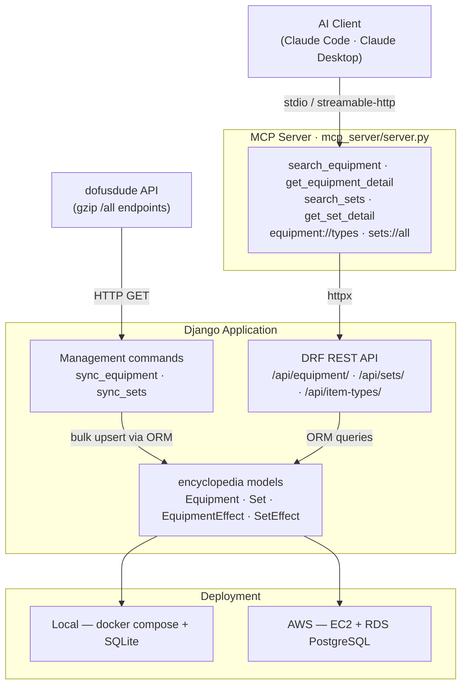

# Les Mémoires d'Otomaï

Django 5.2 backend exposing a Dofus encyclopedia API and a native MCP server for AI-assisted equipment and set queries.


[](https://codspeed.io/s3bc40/otomais-memory?utm_source=badge)

## Architecture



## Quick start

```bash
git clone https://github.com/s3bc40/otomais-memory.git
cd otomais-memory
cp .env.example .env  # fill in SECRET_KEY
uv sync
uv run python manage.py migrate
uv run python manage.py sync_equipment
uv run python manage.py sync_sets
uv run python manage.py runserver
```

**Or with Docker (recommended):**

```bash
cp .env.example .env
docker compose up --build
```

App available at <http://localhost:8000>.

## REST API

Base URL: `http://localhost:8000/api/`

| Endpoint | Filters | Description |
|---|---|---|
| `GET /api/equipment/` | `?q=`, `?type=<ankama_id>`, `?is_weapon=true\|false` | Paginated equipment list with effects |
| `GET /api/equipment/<ankama_id>/` | — | Full detail: weapon stats, effects, recipe, conditions |
| `GET /api/sets/` | `?q=`, `?level=`, `?min_level=`, `?max_level=` | Paginated set list with effects grouped by pieces count |
| `GET /api/sets/<ankama_id>/` | — | Full set detail with resolved equipment list |
| `GET /api/item-types/` | — | All item types (unpaginated) |

All paginated endpoints return 24 results per page. Navigate with `?page=2`.

## MCP server

The MCP server connects AI clients directly to the encyclopedia. It calls the DRF API over HTTP, so it works in both transport modes without code changes.

**Run locally** (requires the Django app on port 8000):

```bash
uv run python manage.py runserver   # terminal 1
uv run python mcp_server/server.py  # terminal 2
```

The `.mcp.json` at the repo root registers the server automatically with Claude Code.

## MCP Configuration

Two config files at repo root cover both connection modes:

| File | Mode | Use case |
|---|---|---|
| `.mcp.json` | stdio (default) | Local Claude Code — launches the server as a subprocess |
| `.mcp.remote.json` | streamable-http | Pi via Tailscale or any remote deploy |

**Switch to HTTP mode** (remote host — Pi via Tailscale, EC2, etc.):

1. Copy `.mcp.remote.json` to `.mcp.json` and replace `<tailscale-ip-or-host>` with the actual host.
2. On the remote machine, set these env vars in `.env`:

```bash
MCP_TRANSPORT=streamable-http   # switch from stdio to HTTP
MCP_BASE_URL=http://<django-host>:8000  # where the Django API is reachable
MCP_HOST=0.0.0.0                # bind to all interfaces (default: 127.0.0.1)
MCP_PORT=8001                   # port the MCP server listens on (default: 8001)
```

Then start the server the same way — `MCP_TRANSPORT` drives the rest, no code changes needed.

**Test with MCP Inspector:**

```bash
npx @modelcontextprotocol/inspector
# set command to: uv run python mcp_server/server.py
```

### Tools

| Tool | Parameters | Description |
|---|---|---|
| `search_equipment` | `name`, `type_id?`, `is_weapon?` | Search by name with optional type and weapon filters. Returns effects, pods, and set membership. |
| `get_equipment_detail` | `ankama_id` | Full item detail: all images, weapon stats, effects, recipe, conditions. |
| `search_sets` | `query`, `min_level=0`, `max_level=200` | Search sets by name with level range. Effects grouped by pieces count. |
| `get_set_detail` | `ankama_id` | Full set detail with resolved equipment list and effects. |

### Resources

| URI | Description |
|---|---|
| `equipment://types` | All item types with `ankama_id`. Read before filtering by type. |
| `sets://all` | All sets ordered by level. Browse before searching. |

## Deployment

See [`docs/deployment.md`](docs/deployment.md) for the full AWS guide (CloudFormation, EC2, RDS PostgreSQL, SSM access, teardown).

## Test suite

48 tests with pytest-django covering models, sync commands, and DRF endpoints.

```bash
uv run pytest
```

CI runs on every push and PR to `main`: lint → format check → pytest.

## Key decisions

- **MCP uses httpx → DRF**, not direct ORM access — the server runs as a separate process and must communicate over HTTP rather than sharing a database connection.
- **MCP transport env-var driven** — `MCP_TRANSPORT=stdio` (default, local Claude Code) / `streamable-http` (remote, Pi via Tailscale). Zero code changes between contexts — twelve-factor pattern.
- **Single gzip request for sync** — dofusdude's `/all` endpoint delivers all ~4 350 equipment items in one compressed payload, avoiding per-page pagination and reducing sync time to ~5 seconds.
- **`transaction.atomic()` for the sync loop** — wrapping the entire upsert in one transaction avoids one disk flush per row on SQLite, cutting sync time from 193 s to ~5 s (38×).
- **One codebase, env-var driven** — `DATABASE_URL` switches between SQLite (local) and RDS PostgreSQL (prod) without any code change.
- **One-shot AWS deploy** — EC2 t3.micro + RDS db.t4g.micro PostgreSQL 17 + Nginx + Docker (eu-west-3). Infrastructure stopped after screenshots — signal captured without recurring cost.
