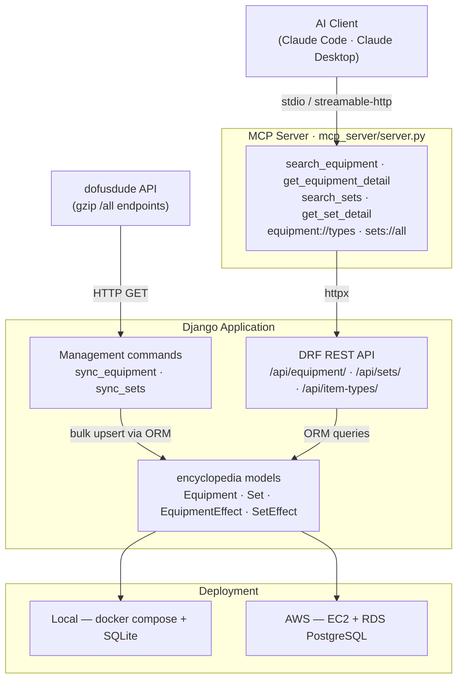

# System Architecture

```mermaid
flowchart TD
    DOFUS["dofusdude API\n(gzip /all endpoints)"]
    AI["AI Client\n(Claude Code · Claude Desktop)"]

    subgraph app["Django Application"]
        SYNC["Management commands\nsync_equipment · sync_sets"]
        MODELS["encyclopedia models\nEquipment · Set · EquipmentEffect · SetEffect"]
        DRF["DRF REST API\n/api/equipment/ · /api/sets/ · /api/item-types/"]
    end

    subgraph mcpsrv["MCP Server  ·  mcp_server/server.py"]
        TOOLS["search_equipment · get_equipment_detail\nsearch_sets · get_set_detail\nequipment://types · sets://all"]
    end

    subgraph deploy["Deployment"]
        LOCAL["Local — docker compose + SQLite"]
        AWS["AWS — EC2 + RDS PostgreSQL"]
    end

    DOFUS -->|"HTTP GET"| SYNC
    SYNC -->|"bulk upsert via ORM"| MODELS
    DRF -->|"ORM queries"| MODELS
    MODELS --> LOCAL
    MODELS --> AWS
    AI -->|"stdio / streamable-http"| TOOLS
    TOOLS -->|"httpx"| DRF
```
